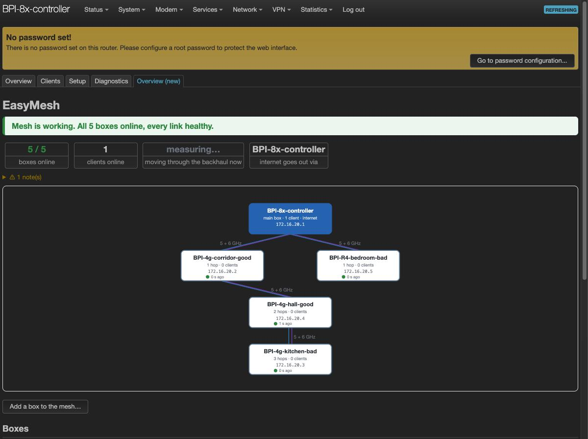
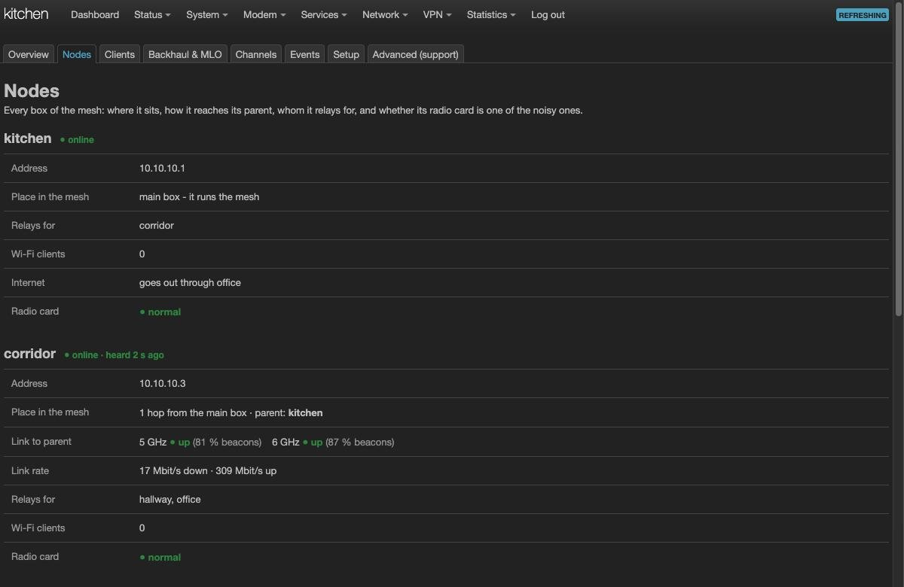
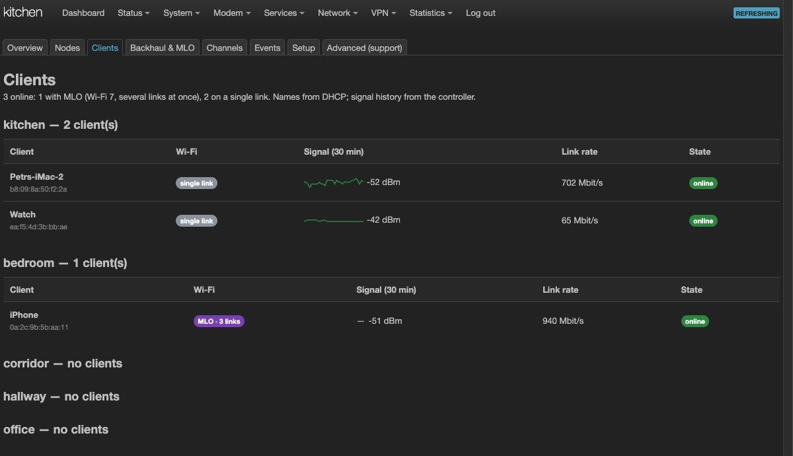
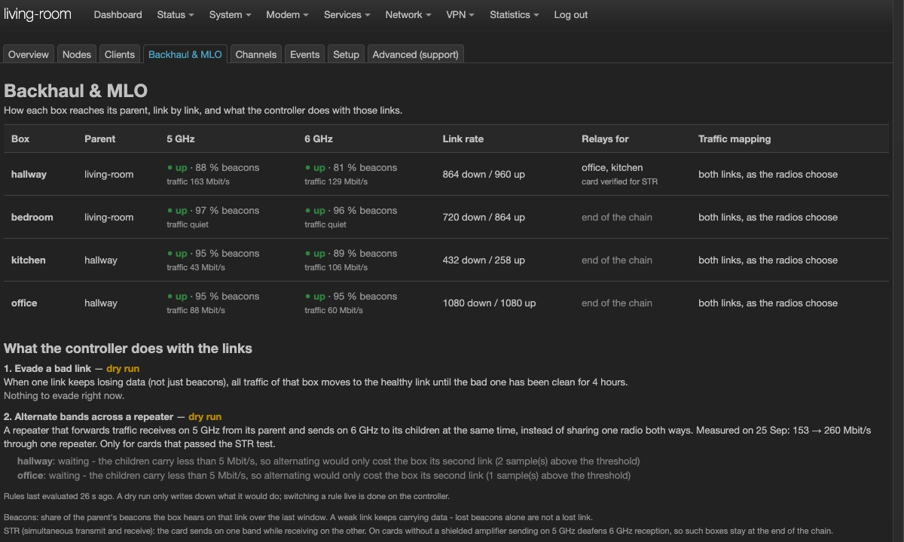
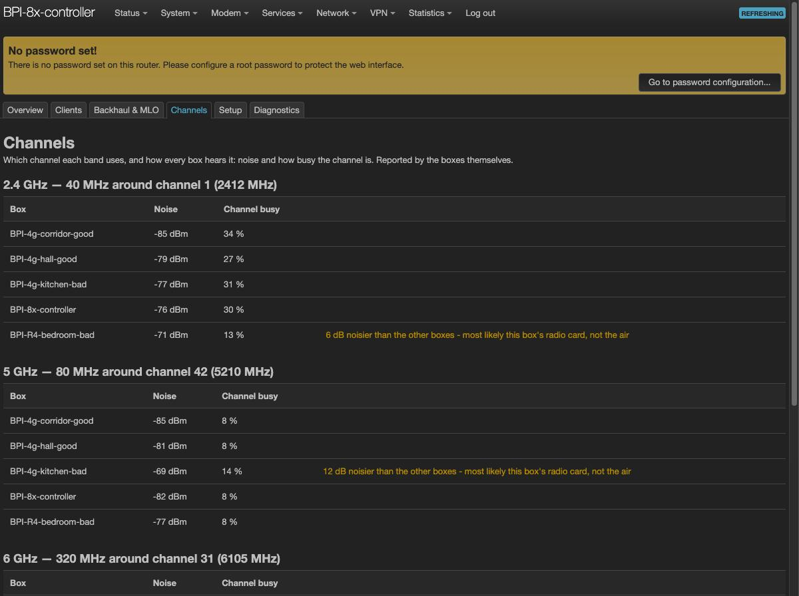
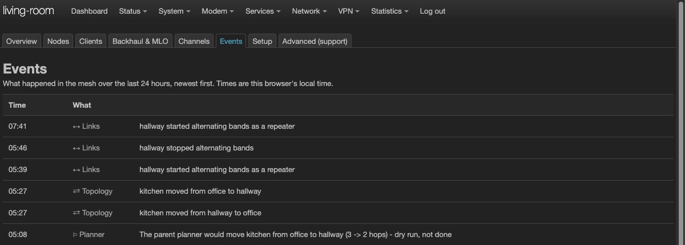
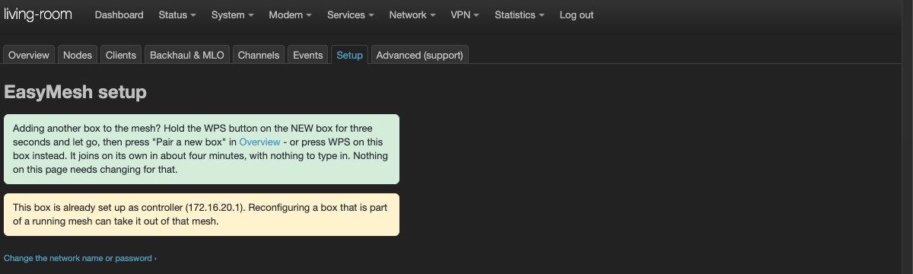
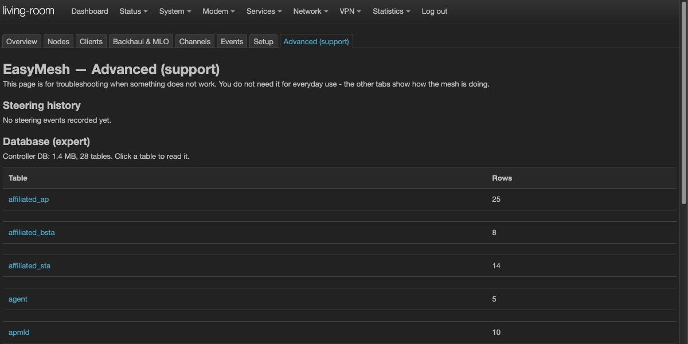

# EasyMesh Wi-Fi 7 for OpenWrt

**A Wi-Fi 7 mesh built from open-source routers, whose main box can steer which band each backhaul link carries.**

*Based on the Wi-Fi EasyMesh™ R6 specification (partly implemented); not certified by the Wi-Fi Alliance, and
certification is not a goal of this project.*

> **Pre-release (v0.1-preview, 4 Oct 2026).** It runs every day on a five-box lab, but it is not a product yet.
> We publish it early for reviewers and testers. It still has bugs - the ones we know are in
> [Known limitations](#known-limitations), and fixes come with the next releases. Please read that section before you flash anything.
>
> **Everything here takes time - give it that time.** Pairing one box takes about 6-10 minutes including two restarts
> (up to 15 on the Pro 8X); how long exactly depends on the distance, the radio conditions and
> the board, a box boots in about 2 minutes (5 on the Pro 8X), a move is measured for about 3 minutes. While
> a box joins, its lamp may go dark. **Do not press any button twice:** a second press cancels the pairing. Pairing a
> five-box mesh takes about three quarters of an hour - enough time for a beer or two. Just don't press any button twice
> while you wait.



## What it does

- **One button to add a box.** Press *Pair a new box* on the main box (or its WPS button), then hold the WPS button on
  the new box. The new box joins the mesh, gets its settings and a factory name you can change, and restarts twice by
  itself while it joins.
- **Wi-Fi 7 multi-link backhaul.** Each box connects to its parent over two links at once, one on 5 GHz and one on
  6 GHz (MLO), when both come up (see *Known limitations*). The main
  box (the EasyMesh *controller*) can tell each backhaul link which band carries which traffic
  (*TID-to-Link Mapping*, TTLM) based on the shape of the whole mesh, not on one radio's view. In this preview the
  automatic policy runs as a dry run; the mechanism itself is verified on hardware.
- **Internet from any box.** Plug the internet cable into any box, and optionally use an LTE/5G modem in one of them
  for failover (see [Optional: LTE/5G failover](#optional-lte5g-failover)). The
  mesh keeps one gateway address for all clients. When the cable is pulled, or the router in front of the box goes
  dead, clients are back online over LTE in about 7-11 seconds; when the cable comes back, the mesh returns to it after
  about half a minute of stable cable, with a gap of a second or two at most (once 32 s in our tests; none when the cable
  and the modem are in the same box).
- **It tells you what is going on.** The web interface (LuCI) shows every box, every link and every client in plain words.
  It also points out a radio card that is noisier than the others, so a slow link is not blamed on the mesh.

## Screenshots

| | |
|---|---|
|  **Nodes:** where each box sits, its links, its radio card |  **Clients:** per box, multi-link or single link, signal history, link rate |
|  **Backhaul & MLO:** both links of every hop and what the controller does with them |  **Channels:** noise and load as each box hears it |
|  **Events:** the last 24 hours in plain words |  **Setup:** start a new mesh or join one, and how to add a box |
|  **Advanced (support):** steering history, the controller database and the raw API, for troubleshooting | |

## Getting started

**You need:**
- **2 boxes** to see the core of it (a controller and one agent over a multi-link backhaul, TTLM on that link);
- **3 or more** to see a real mesh (chains, choice of parent, relaying);
- Banana Pi **BPI-R4** (4 GB or 8 GB) or **BPI-R4 Pro 8X**, each with the **BPI-R4-NIC-BE14** Wi-Fi 7 card (MT7996);
  **the card is the part that differs most from box to box.** Some are noisier than others, a 6 GHz antenna chain can be
  weak, now and then the card does not start at boot, and on its multi-link setup a Wi-Fi reload is not reliable (the mesh
  restarts the box instead). Most odd behaviour we met came from a card or its antennas, not from the mesh: check
  yours with `easymesh-card-check` and read [Known limitations](#known-limitations);
- a microSD card per box, 8 GB or larger and a good one (A1 or better: the main box keeps its database on it). Running from SD leaves whatever is in the box's own flash untouched: take the card out and the
  box boots its old system.
- **For permanent use, the main box is better on eMMC or NVMe.** It writes its database and logs all the time: SD
  cards wear out under that, and a slow one stalls the main box. Until installing to eMMC or NVMe leaves the experimental
  stage ([docs/INSTALL-EMMC-NVME.md](docs/INSTALL-EMMC-NVME.md)), give the main box a high-endurance SD card (A1 or
  better) and keep a spare.

Any box can be the main box, and it can stand anywhere; a BPI-R4 Pro 8X can just as well be one of the others.

### Downloads

Everything is on the [Releases](https://github.com/woziwrt/openwrt-easymesh-wifi7/releases) page:

| you want | release | file |
|---|---|---|
| **to run the mesh** (recommended) | **v0.1-preview** | `…-sdcard.img.gz` for your board, written to an SD card |
| to upgrade a box that already runs it | **v0.1-preview** | `…-squashfs-sysupgrade.itb` for your board (see *Upgrading*) |
| to check a download | the same release | `SHA256SUMS` |
| eMMC or NVMe instead of the SD card (experimental) | *Experimental: eMMC/NVMe install images* | nothing by hand - the installers fetch it, see [docs/INSTALL-EMMC-NVME.md](docs/INSTALL-EMMC-NVME.md) |

The board is in the file name: `bananapi_bpi-r4` (4 GB), `bananapi_bpi-r4-8gb`, `bananapi_bpi-r4-pro-8x`. Everything else on
GitHub - tags, branches, folders - is explained in [What is where](#what-is-where).

### 1. Prepare the cards
Download the image for your board and `SHA256SUMS` from [Releases](https://github.com/woziwrt/openwrt-easymesh-wifi7/releases)
into one folder and check them there: `shasum -a 256 -c SHA256SUMS --ignore-missing` on macOS,
`sha256sum -c --ignore-missing SHA256SUMS` on Linux (each image must say `OK`); on Windows,
`certutil -hashfile <image> SHA256` and compare with its line in `SHA256SUMS`. Then write the image to one SD card per
box. We recommend [balenaEtcher](https://etcher.balena.io/): it writes the `.img.gz` as it is, without unpacking, and
checks what it wrote.

| Board | Image |
|---|---|
| BPI-R4, 4 GB | `openwrt-mediatek-filogic-bananapi_bpi-r4-sdcard.img.gz` |
| BPI-R4, 8 GB | `openwrt-mediatek-filogic-bananapi_bpi-r4-8gb-sdcard.img.gz` |
| BPI-R4 Pro 8X | `openwrt-mediatek-filogic-bananapi_bpi-r4-pro-8x-sdcard.img.gz` |

Set the boot switch of every box to SD (**A = 1, B = 1**). Like stock OpenWrt, every box starts at `http://192.168.1.1` with the user
`root` and **no password** (just click *Log in*). Until a box is set up, its Wi-Fi `OpenWrt-MLD` also uses the published
key `12345678`: build the mesh with nobody else in range, and set root passwords afterwards (step 4).

The image starts with the Wi-Fi country set to **CZ** (Czech Republic). If you are elsewhere, set yours on each box in
*Network → WiFi Manager → Change Country* before you build the mesh; the box restarts after the change (about a
minute). The backhaul uses 6 GHz where your country allows
it; we have built the mesh with CZ only. Where 6 GHz is not allowed, the backhaul runs on 5 GHz only - we have not
tested that.

### 2. The first box becomes the main box (controller)
Connect a computer, set to get its address automatically (DHCP), to the **service port** of the first box - **LAN3**
on the BPI-R4 (4 GB and 8 GB), **LAN1** on the BPI-R4 Pro 8X - and open `http://192.168.1.1`. Use the service port from
the very start: it answers at `192.168.1.1` on every box, before and after the mesh exists. The other LAN ports join the
mesh when you create it, and a computer left on one of them may lose the page.
Go to *Network → EasyMesh → Setup* and click **This is my first box**. Enter the network name, the Wi-Fi password and a
name for the box. The page suggests `10.10.10.1` for *Mesh addresses*. That is only a suggestion: any private address
works (we built the last test mesh on `172.16.20.1`), as long as your home network does not use it and it is not
`192.168.1.x`, which belongs to the service port. That is the only place where you type anything.

Leave *Taking over an existing mesh?* closed for a new mesh. It is only for moving the main-box role to another box in a
mesh that already runs: the boxes that stay keep the old backhaul key and there is no way to tell them a new one, so the
new main box has to start with the old key - then they attach to it by themselves. LuCI does not show the key; read it
on the old main box over SSH:

```sh
for i in 0 1 2 3 4 5 6 7 8 9 10 11; do case "$(uci -q get ieee1905.@ap[$i].ssid)" in MAP--BH*) uci get ieee1905.@ap[$i].key; break;; esac; done
```

Then switch the old main box off for good - two main boxes in one mesh do not work. We have not tested a takeover
with this release.
Click **Create the mesh**, then **Reboot now**. After about 2 minutes (5 on the Pro 8X) the login page comes back by
itself at `http://192.168.1.1`. A computer on one of the other LAN ports or on the mesh Wi-Fi reaches the main box at
**`http://10.10.10.1`** (or the address you chose) and gets a `10.10.10.x` address from it.

**The internet cable** goes into the WAN port of **any** box, the main box or another one. The mesh has internet as soon
as that box has joined. The main box keeps one socket as a [service port](#the-service-port-a-way-in-when-the-mesh-is-not)
at `192.168.1.1`.

### 3. Add the other boxes, one at a time
**Pair each box where it will stand.** It only has to be within reach of the main box's Wi-Fi - the 2.4 GHz network,
which reaches farthest, is enough to pair; the fast 5/6 GHz links then attach to the nearest box. For a place far from
everything, pair the box next to the main box, switch it off, carry it there and switch it on.

**One box at a time, nearest first.** Pair a box only when the one before it is in the picture (*Overview* / *Nodes*).
Pressing the buttons of several boxes at once gives a bad result. Start with the box closest to the main box and work
outwards: a far box paired before the boxes between it and the main box gets its settings, but has nothing to attach its
5/6 GHz links to yet. That is not a fault - it keeps trying and joins by itself once the box in between is in the mesh.

Power the box on and wait until it has booted (about 2 minutes, 5 on the Pro 8X). Then:

1. **On the main box,** open *Add a box to the mesh…* in its *Overview* and click *Pair a new box*, or hold its WPS button for **4 to 8 seconds** (until the
   lamp blinks slowly) and let go. It keeps pairing open for about seven minutes, so there is time to walk over.
2. **On the new box,** hold the WPS button for **4 to 8 seconds** and let go. (On a BPI-R4 Pro 8X no lamp blinks -
   the press still works: count to six and let go.)

**Never hold a WPS button for 10 seconds or longer** - on the new box or on the main box. Let go after that and the box
erases its settings (factory reset): a box in the mesh drops out of it, and the main box loses the whole mesh.

A short press does not pair: the main box ignores it, and on a BPI-R4 that is not the main box it restarts it. The other order
(new box first) works too, but leaves only about three minutes.

The new box joins on its own in about six to ten minutes (up to 15 on a Pro 8X), with nothing to type in. On the way it
restarts twice by itself and once more restarts its services - that is expected, not a fault. (The *Setup* page inside
the box still says "restarts once" and "four to six minutes"; the numbers here are the measured ones - trust these.)
Meanwhile its tile in
*Overview* comes and goes and changes several times: a MAC address, a `BPI-R4-…` name, `192.168.1.1`, one link, a
brown dot. It can look finished two or three times before it is. **Do nothing, and do not press any button** - a second
press cancels the pairing. If the picture looks stuck, reload the page; that never disturbs the pairing.

> **✅ The box is in the mesh when at least 10 minutes (15 on a Pro 8X) have passed since you pressed its button, *and*
> its tile shows all three at once: a `BPI-R4-` name with six characters, a mesh address (not `192.168.1.1`) and a
> green dot.** Only now give it a name (the pencil on its tile) and pair the next box.

After you rename a box, its tile may say *waiting for the box* for a minute or two while the name travels there.

### Optional: LTE/5G failover
If one of your boxes has an LTE/5G modem, the mesh switches to it by itself when the cable internet goes down, and back
when the cable returns. Put that box where the mobile signal is best (by a window, say) - the mesh carries its internet
to all the others. Once the box is in the mesh, open its LuCI (at the mesh address on its tile, from a computer on the
mesh Wi-Fi or a LAN port, or at `192.168.1.1` on its own service port), set the modem up in *Network → Interfaces*
(protocol QMI or MBIM) and **restart that box once afterwards** (see *Known limitations*). Tested: Telit FN990A40 (M.2);
other modems that OpenWrt supports may work, untested.

### 4. Check that it works
- *Overview* says **"Mesh is working"**, all boxes are online, every link is healthy.
- *Nodes* shows each box with its parent and both links (5 GHz and 6 GHz) **up**.
- **The picture is up to about a minute and a half behind the real state.** Each box averages its links over 30 s
  so that one bad second does not paint a healthy link red, and asking every box more often would spend the backhaul
  the mesh needs for your traffic. After a change, wait two minutes before judging it. The key in the corner of the
  picture says what the lines mean; hover a line for its numbers and their age.
- **A thick line with nothing of yours running is a measurement.** A trial move (yours, or the planner's when it is
  on) measures the throughput of a box before and after, about three minutes of traffic on that branch; *Events* says
  which box and why.
- If a box does not appear after fifteen minutes (or *Overview* says it has not finished), pair it again: *Pair a new
  box* on the main box (*Add a box to the mesh…*), then hold the new box's button 4 to 8 seconds and let go. Not earlier - a second press cancels a
  pairing that is still running.
- **Set a root password on every box** (*System → Administration*) once it is in the mesh. The mesh does not need it;
  your network does. Until a box is set up, its Wi-Fi `OpenWrt-MLD` uses the published key `12345678` - so set the box
  up, or keep it off, while strangers are in range.
- While pairing is open (about seven minutes), any device in range that starts WPS gets the mesh's Wi-Fi credentials -
  that is how WPS push-button works. Open it only when you are adding a box.
- To start a box over, hold its button **10 seconds**: that erases its settings (writing its SD card again does the
  same). There is one main box per mesh; if you made a second one by mistake (its *Overview* shows a mesh of one box),
  start that one over and pair it.

### The service port: a way in when the mesh is not

Once a box is part of a mesh, its LAN sockets belong to the mesh. **One socket is kept out of it for good** and answers
at **`192.168.1.1`** on every box, whatever the mesh is doing, across upgrades:

| Board | Service port |
|---|---|
| BPI-R4 (4 GB, 8 GB) | **LAN3** |
| BPI-R4 Pro 8X | **LAN1** (`mxl_lan0`) |

- **The box gives your computer an address there** (no gateway, no DNS, so your computer keeps its internet from
  elsewhere). A fixed address such as `192.168.1.2`, mask `255.255.255.0`, no gateway, works too.
- It is a way in, not a way out: no internet and no mesh traffic go through it.
- **Every box has the same address there.** Connect the service port of one box at a time, straight to your computer,
  never to a switch or to another box. Tell the boxes apart by the name in the web interface, not by the address.
- Use it when a box cannot be reached over the mesh (wrong settings, a box that lost its parent, a failed upgrade).
  In normal use you reach every box through the mesh.

### Upgrading

Flash the new `…squashfs-sysupgrade.itb` on each box with *System → Backup / Flash Firmware* and **keep the settings**.
The mesh settings, the box's role and the main box's database stay. Upgrade the boxes furthest from the main box first and
the main box last, one at a time, and wait until each is back in *Nodes* before the next (about 2 minutes, 5 on a Pro 8X).
Clients on a box lose the internet for up to about half a minute while it upgrades, everyone for about seven minutes
while the main box does. Afterwards the tree may not be the one you had (each box rejoins whoever answers first), and
after the main box the mesh may come back as a star for 10 to a few tens of minutes (see *Known limitations*); put a
box back with *Move…* - the move is measured and undone if it is not faster. This is for boxes running from the SD card:
**do not `sysupgrade` a box installed to eMMC or NVMe yet** (see [docs/INSTALL-EMMC-NVME.md](docs/INSTALL-EMMC-NVME.md)).

## In this pre-release

✅ = verified on hardware in our lab · 🧪 = works, still running as a dry run or under test

- ✅ **Controller and agents based on the EasyMesh R6 specification** (the iopsys stack plus our patches; not certified)
  on OpenWrt 25.12 with the open mt76 driver, on BPI-R4 and BPI-R4 Pro 8X
- ✅ **Multi-link (MLO) backhaul** on 5 + 6 GHz between every box and its parent, relayed over several hops
- ✅ **One-button join** (WPS) with two restarts of the new box on the way. A whole mesh can be built from blank SD cards.
- ✅ **Per-station TTLM driven by the controller:** the controller maps traffic of one backhaul link to one band, in
  both directions, and removes the mapping again
- 🧪 **Automatic TTLM policy:** avoiding a bad link, and alternating bands across a repeater (+70 % across one repeater, 2 hops,
  downloads, in one test series). Runs as a dry run by default.
- ✅ **Persistent controller database:** topology, links, clients and history survive restarts
- ✅ **Gateway failover** between cable and LTE on any box, one gateway address for clients: about 10 s to LTE when the
  cable is pulled (3 of 3 tests, 10/10/11 s); back on the cable without a gap in 2 of 3 tests, once with a 32 s gap.
  With the cable and the modem in the same box (4 Oct 2026): after a power cut of all five boxes the mesh came up on the
  modem alone, and moved to the cable without a gap when it was plugged in
- ✅ **Self-healing after power loss:** repeated power cycles of the whole mesh, and it came back on its own in each of our tests
- 🧪 **Choosing the parent:** the controller moves a box to a better parent on its own, by two plain rules. **Rescue,
  on by default:** its path is bad (under ~100 Mbit/s) and another parent is at least twice as good. **Towards the main
  box, off by default (danger zone):** another parent one hop closer to the controller is at least 1.5 times as good.
  Every move is a measured trial on the box itself (throughput before and after, three rounds each) and is kept only if
  it paid; otherwise the box goes back on its own. One trial in the mesh at a time. In a test after a controller
  restart, three moves brought a relay from 26/47 to 1044/1143 Mbit/s (up/down). In another, a relay was moved by hand
  and two of its children landed on parents at 3 and 6 Mbit/s; the rescue moved them on its own within eight minutes,
  to 190/208 and 207/376 Mbit/s - see [What the mesh does by itself](#what-the-mesh-does-by-itself).
- ✅ **No island when a relay reboots:** a box that has lost its path to the controller stops accepting other boxes on
  its backhaul at once and drops the ones it had, so two children of a rebooting relay cannot join each other
- ✅ **Wi-Fi for clients stays up while a backhaul moves:** a backhaul that lost its parent keeps the box's access
  points running for 20 s, enough to find a new parent on the same channel (a move took ~6 s instead of ~26 s off air)
- ✅ **Bridges follow a moved box:** when the backhaul tree changes, every box forgets its learned bridge entries at
  once. Without it, a box that moved behind another relay was unreachable for up to five minutes.
- 🧪 **A box stuck on a parent it cannot use can move by itself** (off by default - it logs what it would do;
  `touch /etc/mapc/bh-rescue-live` on a box lets it act): when most pings to the main box are lost and a much
  stronger parent is in range, the box moves there, and goes back if the new place does not work. It needs no help from
  the main box, which cannot reach it in that state anyway.
- ✅ **Backhaul watchdogs:** a backhaul BSS that stopped beaconing is re-armed. A backhaul station that has moved away is
  dropped by its old parent.
- ✅ **Radio card check:** noisy cards are found and named in the UI
- ✅ **LuCI app with 8 tabs:** Overview, Nodes, Clients, Backhaul & MLO, Channels, Events, Setup, Advanced
- ✅ **JSON API over ubus** for everything the UI shows

## Planned for the next releases

- **Topology planned toward the gateway, from measured links:** the controller remembers the measured throughput of
  every backhaul link it has seen, per direction, in its database, together with the 5 GHz and 6 GHz signal at the time.
  A record whose signal no longer matches on either band is dropped, so a box that has been moved loses only its own
  links. From these links the controller computes the tree with the least airtime from the *active gateway* to every box
  (downstream, where client traffic goes), rather than toward the controller, and moves boxes one at a time, with
  hysteresis. If the WAN cable is moved to another box, the mesh rearranges around it. A temporary failover to LTE does
  not rearrange anything. This is the airtime metric known from 802.11s and mesh routing protocols. What we add is
  applying it to EasyMesh topology from the controller.
- **The planner as a graph problem:** the mesh as a graph whose edges carry measured link capacities (per box and band,
  calibrated against what the links really carry), the target tree as the shortest-path tree by airtime from the gateway,
  and one rule for every move - it must lower a potential of the whole mesh (the sum of path costs of all boxes) by at
  least 20 %. That replaces today's two thresholds with one criterion that can be explained in a sentence, lets a relay
  move only when its children gain too, and stops oscillation by construction for a given set of measurements. It will
  be checked first against a measured "truth table" of all reasonable trees of the lab before it moves anything.
  Today's planner and the planned one, written down as formulas:
  [docs/TECHNICAL.md → Choosing the parent: the math](docs/TECHNICAL.md#choosing-the-parent-the-math).
- **Traffic statistics history:** traffic per box, backhaul link and client, link quality, topology changes, outages and
  gateway failovers over hours, days and weeks, kept in the controller database with retention, shown as graphs in LuCI
  and exported through the API
- **TTLM policy switched on by default,** after enough A/B measurements, with per-direction STR checks and noisy cards
  kept out of relaying
- **Mitigation for noisy BE14 cards** (beacon timing), on by default once confirmed
- **Join from any box:** press the button on the nearest box of the mesh, not only on the main one (EasyMesh push-button event propagation)
- **Interoperability** with other vendors' EasyMesh controllers and agents, in both roles
- **Radar channels (DFS)** as an option, and channel suggestions from scans
- **Onboarding with DPP (Easy Connect)**
- **Capacity in the UI:** measured maximum of each link, not only the current traffic
- **Arranging the tree from measured links:** the first parent after a start chosen from scans, one measuring method for
  all decisions, a trial move without test traffic, and *Try it → Possible → Confirm* for a move by hand
- **Packages instead of images:** install on an existing OpenWrt 25.12 box, with a setup wizard
- **Upstream:** send our driver and hostapd fixes to their maintainers, patch by patch

## What the mesh does by itself

What matters most is that your devices stay online, so nothing moves a box for speed alone unless you switch it on.
The one exception is a box left on a path under about 100 Mbit/s - that is moved, with a measured trial:

| Mechanism | By default | What it does | What it costs |
|---|---|---|---|
| Finding a new parent after a box or its parent restarts | on | the backhaul joins the best parent it hears, within seconds | the boxes behind a restarting box are offline for 30 s to 2.5 min; after a restart of the main box the whole mesh re-forms and clients are without internet for about 5-6 minutes |
| No island ([details](docs/TECHNICAL.md#self-healing-and-optimisation)) | on | a box without a path to the main box stops accepting others at once | nothing |
| Bridges follow a moved box | on | every box forgets its learned bridge entries when the tree changes | nothing noticeable |
| Moving a box by hand | when you ask | *Backhaul & MLO* → *Move…* next to a box: pick a parent it hears; a measured trial keeps the move only if it is faster, otherwise the box goes back by itself | a few seconds for the box and the boxes behind it; one to three minutes if the new parent does not answer; about three minutes of test traffic |
| Rescue of a box on a bad path | **on** | a box on a path under ~100 Mbit/s moves to a parent at least twice as good, one measured trial at a time; back if it did not pay | as a move by hand, only while a box is that slow |
| Parent planner: towards the main box (danger zone) | **off** (logs only) | also moves a box to a parent one hop closer to the main box when that is clearly better | as a move by hand, whenever it decides to |
| Stuck-box rescue | **off** (logs only) | a box that loses most pings to the main box moves to a parent at least 10 dB stronger, and goes back if that does not work | a few seconds, or one to three minutes if the new place does not answer |
| Deaf-link guard | **off** (logs only) | a box whose parent's beacons are all gone reconnects | the box and the boxes behind it drop for a moment |
| TTLM rules (band steering of the backhaul) | **off** (logs only) | moves traffic of a backhaul link to its better band | nothing noticeable |

**Danger zone.** The switch on *Backhaul & MLO* (or `touch /etc/mapc/parent-steer-live` on the main box) turns on
optimisation algorithms that are still in development. They can arrange the mesh into an illogical topology - a box
under a parent further away than it needs, or a relay hanging below a box it should be serving. Switching them off
again does not restore the previous topology: the correct tree can then only be restored by moving boxes by hand with
*Move…*. What the planner decides, and what it would do while off, is in *Backhaul & MLO* and *Events*. The rescue and
the deaf-link guard are switched on the boxes with
`touch /etc/mapc/bh-rescue-live` and `touch /etc/mapc/deaf-guard-live`.

**How long things take** (measured in our lab):
- a new box joins and carries traffic about six to ten minutes after you pair it, including its two restarts (up to
  15 on the Pro 8X);
- after a power cut of the whole mesh, clients are back on the internet in about 1.5-2 minutes and every box is back in
  under 3 minutes;
- when one box restarts, the clients and boxes behind it are back within 30 seconds to 2.5 minutes; after a restart of
  the main box alone, clients are without internet for about 5-6 minutes, and the rescue may then need from 10 minutes to a few tens of minutes to rebuild the
  chains - it waits 5 minutes for the mesh to settle and moves one box at a time, about 3 minutes each (see *Known
  limitations*);
- a move by hand is decided in about three to four minutes;
- with the planner on, it waits until a box has been stable for about 7 minutes before it tries a move.

## Known limitations

This is a preview. What is not done yet, or not done well:

- **Failover to LTE watches the cable and the first router, not the internet behind it.** A pulled cable, or a router
  in front of the box that is switched off, moves the mesh to LTE in about 10 s. If that router stays up but loses its
  own internet connection, the mesh stays on the cable and has no internet until the router recovers. Checking the
  whole way out is planned.
- **A modem set up while the box is running is not used until the box restarts.** The box puts its modem into the
  `wan` firewall zone when it starts; a modem interface added later has no NAT, and a failover to it carries nothing.
  Restart the box once after setting the modem up (or run `/etc/init.d/mesh-gwd restart`). A fix is planned.

- **Band steering of the backhaul is a dry run by default.** The TTLM rules decide and log what they would do; they only
  act when switched on (`/etc/mapc/ttlm-policy-live`, `/etc/mapc/ttlm-alternate-live`). Per-station TTLM from the
  controller works on hardware in both directions. The automatic *policy* on top of it still needs more nights of testing.
- **The parent planner is deliberately simple.** It corrects parents that are plainly wrong and leaves near-ties
  alone. It estimates a box's own first hop from signal, which can be far off for a noisy card, and it plans toward
  the controller, not toward whichever box currently holds the internet uplink (see *Planned*). How it decides:
  [the math](docs/TECHNICAL.md#choosing-the-parent-the-math).
- **BE14 cards differ, so measure yours.** Some are noisier than others (7–13 dB on the same channel in our lab), and
  on one of our cards the 6 GHz link runs on a single stream at a low rate where the others run on two. On such a card,
  the box's own 5 GHz beacon can briefly deafen its 6 GHz receiver. The mesh detects noisy cards and shows them in
  *Nodes*; `easymesh-card-check` on a box measures its card. A mitigation is being tested. Such a box does best at the
  end of a chain. These are measurements of the few cards we have, not a statement about the cards in general.
- **Check the antenna connectors.** A loose or torn antenna connector shows as one chain far below the other two in
  `iw dev bsta-mld-3 station dump` (e.g. `signal: -68 [-86, -69, -73] dBm` on the 6 GHz link). In our lab two boxes had
  that on 6 GHz, and as parents they accepted 6 GHz authentication only 3 and 0 times out of 6 - their children then
  join over 5 GHz only. `easymesh-card-check` does not look at chains yet.
- **EasyMesh Profile 3 without message security.** DPP onboarding and 1905 encryption are not implemented. Onboarding is
  WPS push-button. The backhaul links themselves are encrypted Wi-Fi (WPA3-SAE). We report Profile 3 capabilities (needed
  for Wi-Fi 7 link reports), so a third-party controller that enforces Profile 3 security will reject our agents: in this
  preview the mesh is meant to be built from our boxes only.
- **5 GHz stays on channel 36** (no radar channels) by default: a radar hit on a radar channel would take the backhaul
  down for at least a minute, and background radar detection is not enabled or tested in this release.
- **Every move costs a moment of connectivity.** When a box is moved - by hand or by the planner - that box and the
  boxes behind it are off the mesh for a few seconds, for one to three minutes if the new parent does not answer, and a
  trial loads that branch with test traffic for about three minutes while it measures. That is why, by default, only a
  box on a path under about 100 Mbit/s is moved (`touch /etc/mapc/parent-rescue-off` on the main box stops even that).
- **After pairing, a power cut, an upgrade or a restart of the main box or of a relay, the tree follows the radio, not the floor plan.** The tree
  is whoever answers first: a box may hang behind a box with a weaker card, or one hop further from the main box than it
  needs to be. **It can look illogical - we know, and arranging the tree from measured links comes in a later release**
  (see *Planned*). The mesh works, some paths are slower; a box left under about 100 Mbit/s is rescued by itself. Until
  then, put a box where you want it with *Move…*.
- **After a restart of the main box alone, the mesh tends to become a star.** Relays drop their children while their own
  path is down, so when the main box comes back every box attaches straight to it, far ones at a few Mbit/s. The rescue
  then rebuilds the chains one box at a time - 10 minutes to a few tens of minutes in our tests (a four-hop chain of
  boxes at 3 Mbit/s took the rescue about 20 minutes; one of its moves took a relay from 2/4 to 670/848 Mbit/s).
  Keeping children attached while a relay
  reconnects is planned. (A power cut of the whole mesh does not do this: the boxes start together.)
- **Not fully understood, with a defence in place:** after pairing from a blank card, a box sometimes cannot authenticate
  over 6 GHz and joins over 5 GHz only; its traffic to the parent can then stall. In our lab this happened towards parents
  with a damaged 6 GHz antenna connector (see *Check the antenna connectors*). The last of its restarts during
  pairing clears it in our tests, and a guard restarts a box whose uplink stalls twice within half an hour.
- **A client that switches bands on the same box can stall for up to about a minute.** A laptop that moves from one
  band to another of the same box (for example from 5 to 2.4 GHz) can stay connected but pass no data until the box drops
  it as inactive; it then reconnects by itself. When the laptop's old entry on the other band is removed, hostapd
  removes it by address, and the current connection goes with it. This release shortens the stall from five minutes to one; a fix in hostapd is planned. Clients that use several
  bands at once (MLO) are not affected.
- **A box moved to eMMC or NVMe with the experimental installers loses its name** in a mesh whose main box runs
  the `v0.1-preview` SD card: it shows as `BPI-R4-eMMC-…` or `BPI-R4-NVMe-…`; rename it in *Nodes*.
- **After a box was cut off from the mesh, the main box may not see the clients that joined it meanwhile.** They have
  internet, but *Clients* does not list them until they reconnect:
  the box does not report them again when its own link comes back. Meanwhile the main box cannot steer those clients
  either. A fix is planned for the next release.
- **A multi-link (MLO) client has no signal history in *Clients*.** Its current signal, its links and its link rate are
  shown, but the 30-minute graph stays empty: the main box records its signal as zero. A fix is planned for the next
  release.
- **A box that lost its parent can pick a weak 6 GHz link.** It reconnects to what it hears, and wpa_supplicant may
  prefer a 6 GHz link at -80 dBm to a better 5 GHz one (once in our lab: 0/4 Mbit/s for 15 minutes). If its path stays
  under about 100 Mbit/s, the rescue moves it; a faster choice of the band is planned.
- **The box restarts where a Wi-Fi reload would seem enough** - while it pairs, after its Wi-Fi settings change, and
  when its radios need a clean start. That is deliberate. On the multi-link (MLO) setup of the MT7996 (BE14) card, a
  Wi-Fi reload has been unreliable in our tests: the radios sometimes did not come back, or a link came back without
  traffic. A restart costs one or two minutes (five on a Pro 8X) but always ends in a known state. The last restart while
  a box pairs also clears a case where its 6 GHz link would otherwise stall. If you want to remove a restart, measure the
  reload on several boxes and over several days first.
- **On the BPI-R4 Pro 8X the lamps do not show pairing.** Its board wires the LEDs differently, so holding its WPS
  button gives no blink. The press still works - just wait. A Pro 8X boots slowly (about five minutes), so give its
  pairing 10-15 minutes.
- **Sometimes the Wi-Fi card does not start.** Now and then the MT7996 firmware fails to load at boot
  (`Failed to start patch` / `probe failed -11` in the kernel log) and the box runs without Wi-Fi. A restart does not
  help: **switch the power off for 30 seconds.** The Pro 8X cannot reset its Wi-Fi card from software. You notice it
  because the box does not come back into *Nodes*.
- **A box that lost one of its two backhaul links keeps going on one.** The mesh does not reconnect it to get the
  second link back on purpose: a reconnection takes the box and every box behind it off the mesh for up to a minute.
- **The controller database lives on the boot medium.** A slow SD card can stall the main box for seconds; use a good
  one (A1 or better). This release runs from the SD card; installing to eMMC or NVMe is experimental ([docs/INSTALL-EMMC-NVME.md](docs/INSTALL-EMMC-NVME.md)).
- The web interface is in English only.

## What is ours and what is not

Built on the work of others, and we say exactly where the line runs:

| Layer | From |
|---|---|
| OpenWrt 25.12, Linux 6.12 | OpenWrt project |
| Wi-Fi driver (mt76), hostapd, wpa_supplicant, firmware; **the TTLM mechanism itself** (mt76 patch `0073`, Michael-CY Lee) | MediaTek (via the MediaTek OpenWrt feed) |
| EasyMesh stack: `ieee1905`, `map-controller`, `map-agent`, `wifimngr`, `libwifi` | iopsys / Genexis (BSD-3-Clause) |
| Patches on top of that stack (multi-link backhaul, TTLM policy transport, reporting fixes, …) | **ours** |
| Mesh services: setup and one-button join, persistent controller database, gateway failover, link watchdogs, radio card check, TTLM policy producer, LuCI app | **ours** |

**Our claim, stated precisely:** as far as we could find (search of public code and papers, September 2026), this is the
first **publicly documented, hardware-measured** EasyMesh controller that **drives TID-to-Link Mapping of backhaul links
according to the mesh topology, on an open-source stack** (open mt76 driver, hostapd and EasyMesh stack; the Wi-Fi
firmware is MediaTek's binary). The TTLM actuator in the driver is MediaTek's; the decision and
its delivery over EasyMesh (IEEE 1905, *Service Prioritization Request*) are ours. We do **not** claim to have invented TTLM
or controller-driven link mapping. The idea is in the EasyMesh specification, and closed implementations may exist.
How to check the claim yourself: [docs/TECHNICAL.md → Verifying](docs/TECHNICAL.md#verifying-the-claim).

## What is where

| name | what it is | what it is for |
|---|---|---|
| **v0.1-preview** (release) | SD card images and `sysupgrade` images for the three boards, `SHA256SUMS` | installing and upgrading - start here |
| **Experimental: eMMC/NVMe install images** (release, tag `lab-emmc-rc4`) | NAND, eMMC and NVMe images | downloaded by the eMMC/NVMe installers, not by hand ([docs/INSTALL-EMMC-NVME.md](docs/INSTALL-EMMC-NVME.md)) |
| `v0.1-preview` (tag) | the commit the release images were built from | rebuilding exactly the release |
| `main` (branch) | the source of the release, this README, the docs | reading, building, reporting issues against |
| `emmc-nvme` (branch) | `main` plus the experimental eMMC/NVMe installers | installing to eMMC or NVMe |
| `build-bpi-r4.sh`, `build-bpi-r4-pro-8x.sh` | the builds of the images, one per board | building from source ([BUILD.md](BUILD.md)) |
| `pins.conf` | the exact revisions of OpenWrt, the MediaTek feed and iopsys | a build that gives the same image |
| `feed/` | our packages: the mesh tools and API, the LuCI app `luci-app-easymesh`, `luci-app-wifimgr` | what makes the mesh run and what you see |
| `iopsys/` | the iopsys Multi-AP stack (controller, agent, IEEE 1905) and our changes to it | the EasyMesh core |
| `patches/` | our patches to the kernel, Wi-Fi (hostapd, mt76), U-Boot, LuCI and the MediaTek feed | what the boards and the mesh need below the packages ([docs/PATCHES.md](docs/PATCHES.md)) |
| `boards/` | what differs per board: device tree, image layout, files baked in | BPI-R4 and BPI-R4 Pro 8X |
| `configs/` | the build configuration | which packages go into the images |
| `scripts/` | the code both builds share, and a quick image tool for testing | building |
| `extras/` | LuCI apps by other authors, unchanged (CPU, temperature, LTE modem, SMS, scheduled restart, watchdog) | what users of these routers expect besides the mesh; each keeps its license |
| `docs/` | [TECHNICAL.md](docs/TECHNICAL.md) (how the mesh decides, with the math), [PATCHES.md](docs/PATCHES.md), [INSTALL-EMMC-NVME.md](docs/INSTALL-EMMC-NVME.md), screenshots | the details behind this README |

## For reviewers

Written for three groups: **BPI-R4 users on OpenWrt** (images, the install steps, what works and what does not),
**Banana Pi / Sinovoip** (Wi-Fi 7 mesh on their boards on an open stack, and how cards and boards measured in our lab),
and **Wi-Fi driver, hostapd and EasyMesh developers** (patches, messages, measurements).

- **Wi-Fi driver, hostapd and EasyMesh people:** the architecture, the messages we use, where we deviate from the
  specification and the measurements are in [docs/TECHNICAL.md](docs/TECHNICAL.md); every patch below the EasyMesh layer
  is listed in [docs/PATCHES.md](docs/PATCHES.md). Review of single patches is very welcome.
- **Testers:** a report with two boxes is already useful. Please attach the output of `easymesh-check` and a screenshot of
  *Nodes*. Issues are welcome; this is one person's project and they are answered when time allows - there is no support.


## Building from source

The exact recipe (OpenWrt, MediaTek feed and iopsys feed pinned to commits) is in [BUILD.md](BUILD.md): one script per
board, `./build-bpi-r4.sh` and `./build-bpi-r4-pro-8x.sh`.

## Who made it

Petr Wozniak, in collaboration with Claude, an AI assistant by Anthropic. Every change was built, flashed and tested on
real hardware - a five-box lab running around the clock. The numbers in this README come from that lab and from dated
tests; [docs/TECHNICAL.md](docs/TECHNICAL.md) has the details.

## License

Our code: BSD-3-Clause (EasyMesh services, LuCI app), GPL-2.0-or-later (kernel and device tree changes). Patches keep the
license of the code they change. Third-party components keep their own licenses (iopsys: BSD-3-Clause, hostapd: BSD,
mt76: ISC). See [LICENSE](LICENSE) and [LICENSES.md](LICENSES.md).

Copyright (c) 2026, Petr Wozniak (WOZIWRT project)

This project is based on the EasyMesh R6 specification (partly implemented) and is not certified by the Wi-Fi Alliance. Wi-Fi EasyMesh is a
trademark of the Wi-Fi Alliance.
